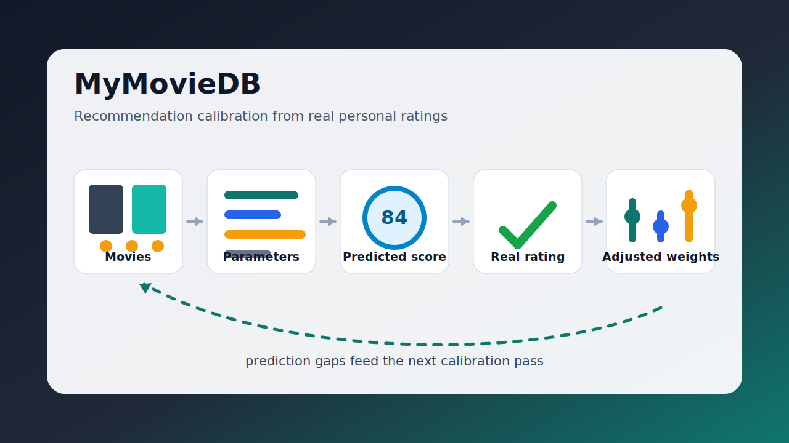

# MyMovieDB



MyMovieDB is a local-first ASP.NET Core + SQLite movie recommendation lab. The main value is not just storing a movie list, but making personal taste prediction visible and adjustable: movies are evaluated with meaningful parameters, scored with weighted rules, compared with real ratings, and recalibrated over time.

It demonstrates deterministic recommendation logic, scoring experiments, local data management, reporting, and dataset cleanup workflows.

Локальная база фильмов на ASP.NET Core + SQLite.

## Core idea: recommendation calibration

1. Tag and evaluate movies by meaningful parameters: genre, tone, pacing, themes, creators, quality signals, and personal taste tags.
2. Calculate a predicted fit score using transparent weights and deterministic scoring rules.
3. Compare the prediction with the user's real rating after watching.
4. Adjust weights, thresholds, and calibration profiles based on the gaps between prediction and reality.
5. Improve future recommendations by making the scoring model better aligned with what the user actually likes or dislikes.

This is iterative calibration and scoring, not an ML training pipeline. The repository is designed so the reasoning, benchmark outputs, and data cleanup steps remain inspectable.

## Что оставлено в корне
- `run-dev.bat` — главный запуск
- `build-release.bat` — release publish
- `missing-report.bat` — отчёт по ненайденным фильмам
- `global.json`
- `README.md`
- `src/`
- `tools/`
- `scripts/`

## Запуск
1. Распакуй архив в любую папку
2. Запусти `run-dev.bat`

Данные, база и настройки лежат в:
`Documents\MyMovieDB`

## Recommendation Tuning / Benchmark

Before running the long benchmark, run a metadata refresh once so the database has current OMDb/TMDb ratings, keywords, and cached TMDb review evidence:

```powershell
dotnet run --project C:\Dev\MovieDb\tests\LocalMovieVault.Web.Tests\LocalMovieVault.Web.Tests.csproj -- --refresh-quality-metadata --out C:\Users\micha\AppData\Local\Temp\MovieDb-Codex\quality-metadata-refresh-full
```

Then run the offline taste benchmark:

```powershell
dotnet run --project C:\Dev\MovieDb\tests\LocalMovieVault.Web.Tests\LocalMovieVault.Web.Tests.csproj -- --taste-benchmark --max-holdouts 40 --out C:\Users\micha\AppData\Local\Temp\MovieDb-Codex\taste-benchmark-after-review-refresh
```

Resume an interrupted run with the same command plus `--resume`.

The benchmark tries 486 scoring profiles:

- `Genre calibration variant`: genre-specific IMDb mild-risk thresholds. Current variants are `baseline`, `forgiving-genre`, and `strict-drama-animation`.
- `BroadFitScale`: how much broad feature overlap matters: genres, tags, creators, countries, languages, plot keywords.
- `SimilarityScale`: how much direct similarity to already rated movies matters.
- `FinalScoreScale`: compresses or expands the final displayed score after affinity/confidence/rank calibration.
- `ExternalQualityRiskPenaltyScale`: how strongly external quality/review risk lowers affinity and final score.
- `SevereExternalQualityScoreCap`: hard top cap for severe external quality failures, e.g. very poor ratings plus bad review/craft evidence.

Outputs are written under the chosen `--out` folder:

- `progress.log`: live progress.
- `summary.csv`: ranked profile summary for analysis.
- `rows.jsonl`: per holdout prediction details.
- `guards.jsonl`: guard-film checks such as mismatch and known-risk examples.
- `state.json`: resume state.
